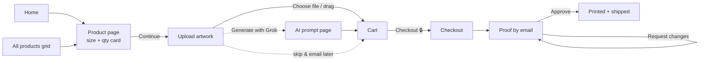

# 1. Sticker Mule UX Teardown

**Goal:** understand why Sticker Mule is considered the benchmark for custom-print e-commerce, and pull out patterns we can reuse for a sign company.

> **Research note:** the screen-by-screen details in section 1.3 come from screenshots of the live site (in [`screenshots/`](screenshots/)). Policy details (proof timing, approval deadline) come from Sticker Mule's own help pages, listed under Sources.

## 1.1 The core insight

Most print shops sell like a **B2B quote shop**: "Request a quote → wait for an email → negotiate → pay." Sticker Mule sells custom work like a **normal online store**: pick options, see the price, buy. Then it moves all of the "is my file right?" uncertainty to **after** checkout, into a free proof step where you aren't charged until you approve.

That one decision removes the four biggest fears a first-time buyer has:

| Fear | How Sticker Mule removes it |
|---|---|
| "How much will this cost?" | Every quantity shows a total and a green "Save X%" before you upload anything. The bottom of the card shows the total and the per-sticker price ("$60 · $1.20 / sticker"). |
| "What if my file is bad?" | The upload page subhead says it outright: **"Free artwork setup. Online proof. Pay only after you approve."** |
| "I don't even have a design." | Two escape hatches on the upload page: **"Generate with Grok"** (AI) and **"skip this step & email artwork later."** |
| "Can I trust this company?" | "4.69 from 364,498 reviews · Trusted by 50,628 sellers" in the home hero; "91,493 reviews" next to the product title. |

## 1.2 The flow (verified)

## 1.3 Screen by screen

### Home ([screenshot](screenshots/sm-home.webp))
- **Dark brown nav:** Products ▾, Samples, Marketplace, Deals, Get PRO, then search, cart, Log in, Sign up.
- **Full-width orange hero:** "Buy and sell custom products". Subhead: "Free worldwide shipping. Fast turnaround. 24/7 support." Three promises in seven words.
- **Two buttons:** blue **Shop now** and a quieter orange **Make money** (their marketplace).
- **Social proof directly under the buttons:** "★ 4.69 from 364,498 reviews · Trusted by 50,628 sellers". Both numbers are links.
- **Category row** right below the hero: Stickers, Labels, Magnets, Buttons, Packaging, Apparel, Acrylics. Each icon is the **same mule mascot** rendered as that product. It works as a consistent illustration system.
- **"$10 off your first order" popup** in the corner asks for an email. It's a lead-capture pattern that covers part of the page (see critique).

### All products (shared screenshot)
- Orange header band: "All products", stars + "364,498 reviews · Free shipping", and a **Get samples** button.
- A "Sort by: Most popular" control.
- A 4-column grid of large illustrations, again the mule mascot as every product. **No prices on the grid.** The page is for picking a product type; pricing waits for the product page.

### Product page ([screenshot](screenshots/sm-product-page.webp))
- **Title row:** "Die cut stickers ★★★★★ 91,493 reviews". The review count sits on the same line as the name.
- A three-sentence benefit description ("…They're even dishwasher safe.") and an **Order samples** button for people not ready to commit.
- A big lifestyle photo of real customer stickers fills the left side and the background.
- **The configurator is one white card with a thick grey border**, pinned on the right:
  - **Select a size** with a **Size help** link on the same line. Plain radio rows: 2″×2″, 3″×3″, 4″×4″, 5″×5″, **Custom size**.
  - **Select a quantity:** 50 → 10,000, each row is `○ quantity · total price · Save X%` (green). Ends with **Custom quantity**.
  - **Total:** big "$60" with "$1.20 / sticker" beside it.
  - A full-width **orange Continue** button.
  - Under it, a muted line: **"Next: upload artwork →"**. This is *feed-forward*: it tells you what the button will do before you press it.
- No dropdowns. Every option and price is visible at once.

### Upload ([screenshot](screenshots/sm-upload.webp))
- Centered heading **"Upload your artwork"** and the subhead **"Free artwork setup. Online proof. Pay only after you approve."**
- A big dashed drop zone with a **blue "Choose file…"** button and "or drag and drop".
- A second card: **"✨ Generate with Grok"**, which opens a separate page ([screenshot](screenshots/sm-generate-with-grok.webp)) with "What would you like to create?" and a "Describe your idea…" prompt box.
- A text link: **"or, skip this step & email artwork later."**
- Nothing else on the page: no nav clutter, no upsells.

### Cart ([screenshot](screenshots/sm-cart.webp))
- A large **"Cart"** heading and a simple table: DESCRIPTION / QUANTITY / TOTAL.
- Each row: artwork thumbnail, product name (link), size + **Edit** link, file name (truncated), an **editable quantity box**, line total, and an ⓧ remove button.
- **Summary box:** "Subtotal: $60", "Free shipping", and a big **orange "Checkout 🔒"** button. The lock icon signals security right at the commitment point.
- **"Share your cart"** link, useful when someone else pays (a boss or a client).
- **"Add more to your order"** cross-sell carousel of other products, below the fold so it doesn't compete with Checkout.
- Footer reduced to Privacy & Terms, language/currency, Help. Distractions are stripped out near checkout.

## 1.4 Patterns worth stealing

| Pattern | Where | Why it works (UX principle) |
|---|---|---|
| Radio lists with prices, not dropdowns | Product | Recognition over recall; all choices visible at once |
| "Save X%" on every tier | Product | Anchoring: the bulk discount is visible without any math |
| Per-unit price next to total | Product | Lets people compare value, not just total cost |
| "Next: upload artwork →" | Product | Feed-forward; reduces uncertainty about what a click does |
| Custom size / Custom quantity | Product | Covers edge cases without cluttering the main list |
| Size help link | Product | Help at the moment of doubt, not in a separate FAQ |
| Order samples / Get samples | Product, All products | Low-commitment entry for hesitant buyers |
| "Pay only after you approve" | Upload | Risk reversal at the moment of anxiety |
| Skip upload / AI generate | Upload | No dead ends; people without a file can still finish |
| Two button colors | Everywhere | **Orange = commit/advance** (Continue, Checkout). **Blue = explore/input** (Shop now, Choose file, Claim). |
| Lock icon on Checkout | Cart | Security cue exactly where trust matters |
| Editable qty in cart | Cart | Fix mistakes without going back |
| Share your cart | Cart | Supports the "someone else pays" job |
| Mascot illustration system | Home, All products | Instant brand recognition; every product looks consistent |

## 1.5 Weak spots (for your critique section)
1. **First-order popup** covers part of the page and interrupts the very first visit. It trades UX for email capture.
2. **No prices on the All products grid.** It looks clean, but a price-sensitive user has to click into each product to compare.
3. **Mascot icons are abstract.** Seeing a horse as a magnet, then as a label, doesn't show what *your* product will look like. The product page fixes this with real photos.
4. **Proof deadline is hidden in help docs:** approve by 5pm ET the next business day or delivery slips. It isn't shown in the main flow.
5. **Card required up front** even though the charge is deferred. Some first-timers hesitate here.
6. **Hero headline is about the marketplace** ("Buy and sell"), which may confuse someone who just wants stickers.

## 1.6 How Postline adapts this
| Sticker Mule | Postline Signs | Why we changed it (or didn't) |
|---|---|---|
| Configurator card, radio rows, Save % | Same | Core pattern, kept as-is |
| "Next: upload artwork →" | Same | Kept |
| Generate with Grok | "No design? Describe it and we'll design it free" | Sign buyers (realtors, cafés) often have no file. A human designer request fits a small sign shop better than AI. |
| No live preview on upload | **Live preview of your file on the sign** at true proportions | Signs are big. Seeing your art on a 24 × 18 yard sign reduces "will it look right?" anxiety. |
| Size help | Size help with a sign-specific rule (1 in of letter height ≈ 10 ft of viewing distance) | Real domain knowledge for signs |
| Proof deadline hidden in help | Stated on the proof page | Fixes weak spot #4 |
| Popup on first visit | Kept, dismissible, bottom corner, never blocks | Kept so the class can discuss the trade-off |
| No prices on grid | Kept | Matches the source, and is a discussion point |

## Sources
- Screenshots of stickermule.com: [`screenshots/`](screenshots/)
- [Sticker Mule – Ordering FAQs](https://www.stickermule.com/support/faq/ordering)
- [Sticker Mule – Artwork FAQs](https://www.stickermule.com/support/faq/artwork)
- [Sticker Mule – What changes can I request to my proof?](https://www.stickermule.com/support/change-requests)
- [Sticker Mule – Changes after approval](https://www.stickermule.com/support/change-requests-after-approval)
- [Sticker Mule – How to order custom stickers](https://www.stickermule.com/write/stickermule/how-to-order-custom-stickers)
- [Bootstrapping Ecommerce – Sticker Mule Review 2026](https://bootstrappingecommerce.com/sticker-mule-review/)
