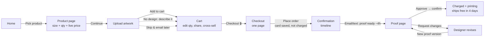

# 2. User Flow: Postline Signs

Postline Signs is our fictional sign company. Its ordering flow copies Sticker Mule's structure and adapts it to signs (yard signs, banners, aluminum, acrylic, A-frames, window decals).

## 2.1 Happy path

The **only irreversible step** is "Approve → Yes, print it". Everything before it can be undone for free.

## 2.2 Screen by screen

| # | Screen | User's question | What the screen answers | Primary action |
|---|---|---|---|---|
| 1 | Home | "Can these people make my sign, fast?" | Promo bar (free shipping · free proofs · 4 days), product grid with "from" prices, 4-step "How ordering works", reviews | **Shop signs** |
| 2 | Product | "What will it cost?" | Configurator card: size list (+ Size help, Custom size), quantity rows with total and Save %, Custom quantity, big total + price per sign, "Next: upload artwork →" | **Continue** |
| 3 | Upload | "Is my file good enough?" | "Free artwork setup. Online proof. Pay only after you approve." Choose file / drag, or describe it for a free design, or skip | **Add to cart** |
| 4 | Cart | "Did I get it right?" | Thumbnail, size + Edit, file name, editable quantity, remove, subtotal + Free shipping, Share your cart, Add more to your order | **Checkout 🔒** |
| 5 | Checkout | "Is this safe? Anything hidden?" | Express pay, short form, "You won't be charged until you approve your proof", Free shipping + Free proof lines, first-order discount if claimed | **Place order · $total** |
| 6 | Confirmation | "What happens now?" | Timeline: placed → proof → you approve → printed → delivered by date | **Review proof** (arrives by email in real life) |
| 7 | Proof | "Is this exactly what I'll get?" | Mockup with dimension lines, checklist (size, bleed, resolution, qty), version history | **Approve proof** / Request changes |

## 2.3 Alternate and error paths

| Situation | What the design does |
|---|---|
| No artwork yet | "skip this step & email artwork later" link; cart row says "Artwork: email after checkout". |
| No design at all | "No design? Describe it and we'll design it free" opens a text box; cart row says "Design request: …". |
| Wrong quantity in cart | Edit the quantity box in the cart; line total and subtotal update instantly. |
| Unusual size or quantity | "Custom size" (width × height in inches) and "Custom quantity" rows; price updates as you type. |
| Unpreviewable file (PDF, AI) | File is accepted; callout says "We can't preview this file type here, but we'll use it for your proof." |
| Wants to change an item in cart | **Edit** reopens the product page with that item's options, then replaces the line. |
| Form errors at checkout | Inline message under each bad field, written as a fix ("Enter a 5-digit ZIP."), focus jumps to the first error. |
| Empty cart | Empty state with one action: **Browse signs**. |
| Change request with empty text | Inline error: "Describe the change so our designer knows what to do." |
| Accidental approval | Two-step confirm: "Approve and start printing? We'll charge $X… Changes aren't possible after this." |

## 2.4 Button color system (copied from Sticker Mule)
- **Yellow = commit / move forward:** Continue, Add to cart, Checkout 🔒, Place order, Approve proof.
- **Blue = explore / provide input:** Shop signs, Choose file…, Claim.
- **Outlined / text links = secondary:** Try 1 sign, Size help, Edit, skip, Share your cart.

## 2.5 Progress indicator
Steps 3–7 show a 4-step progress bar: **Choose options → Upload artwork → Cart & checkout → Approve proof**. The proof is shown as part of the order flow, so users know up front that a review step is coming.
